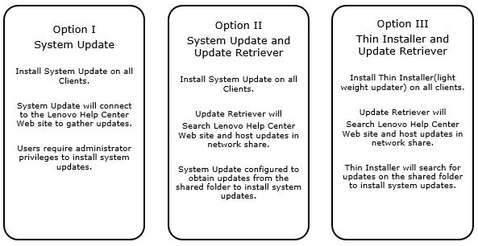

# LENOVO SYSTEM UPDATER

##  **NEED FOR AUTOMATED SYSTEM UPDATES**

*   Speed : Allow Client Support to quickly deploy system updates/drivers through automated fashion.
*   Self-Service: Allow users to install/postpone system updates when delivered without process delays or requiring admin assistance.
*   Security: This will eliminate vulnerability risks inherent from user’s with outdated system updates/drivers.
*   Report: Provides useful data around automated system updates. 
    *   “What are top frequently updates system modules?” 
    *   “Success Rate?” 
    *   “How many are reliable?”

## **REQUIREMENTS**

*   Lenovo Update Retriever/Thin-Installer.
*   Marimba Packager/Transmitter.
*   Active Directory Integration.
*   Repeatable Update Publish Process.
*   Email Notifications – Automated Reports.
*   Automated Delivery/Updates.

## **POSSIBLE SOLUTIONS**
.

## **TOOLS/SERVICES/APPLICATIONS INVOLVED**
*   Lenovo Repository Server
    *   Update Retriever 5.00.0032
    *   Thin Installer 1.2.0026
*   Marimba 9.x
    *   Automated Content Delivery
    *   Interactive Notifications
*   Exchange Server
    *   Email Notifications
*   Active Directory 
    *   User Database

## **INTERGRATE MARIMBA & LENOVO
*   Package/Deploy Model/Architecture Specific Content Packages.
*   Deploy Marimba Lenovo Thin Installer Service Channel.
*   Thin Installer Service Channel handles updates.
*   Thin Installer Service Channel captures package compliance.
*   Compliance data captured and stored in database for reporting.

## **LIMITATIONS**
*   Lenovo does not recommend remote BIOS updates.
*   Mandatory QA Testing required before all deployments.
